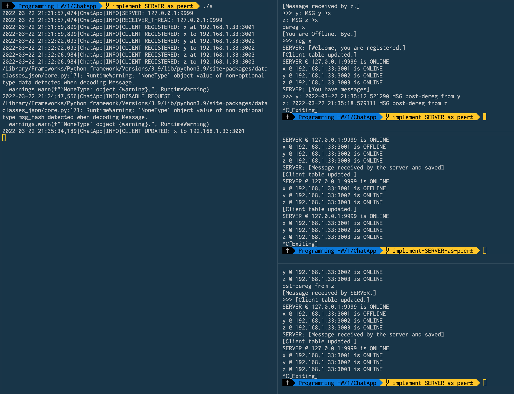
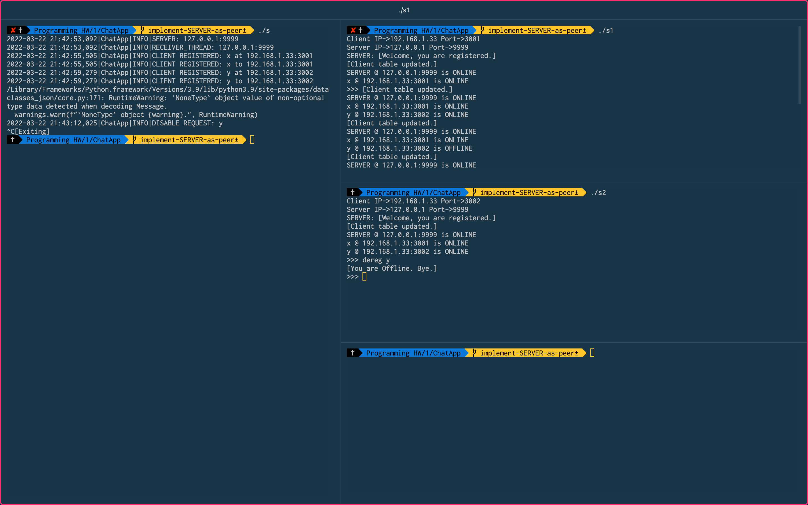
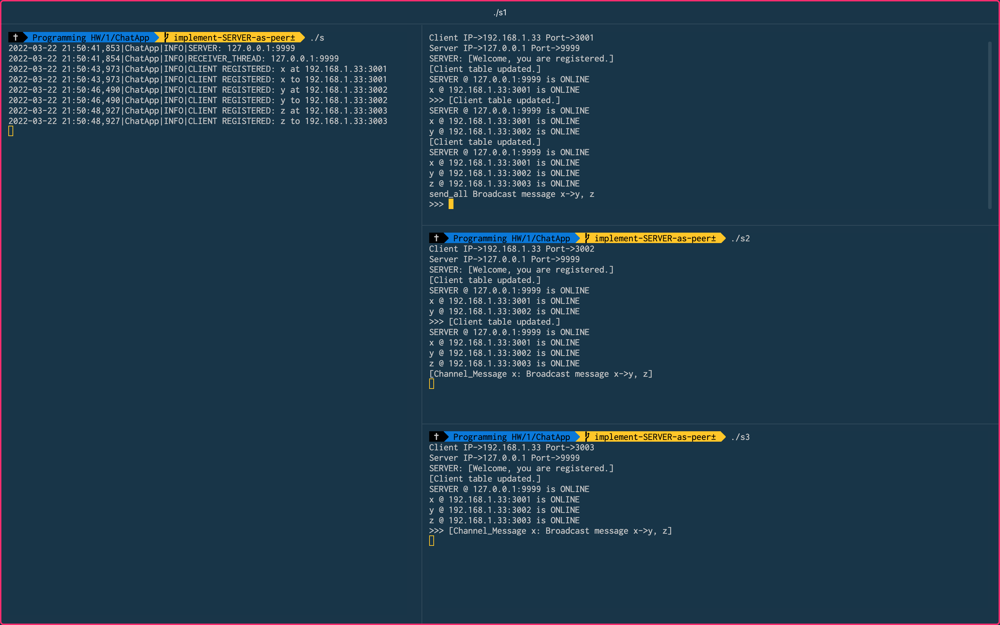

## Author

- **Name:** Sophia Raji
- **UNI:** sr3729
- **Github:** [@sudosoph](https://www.github.com/sudosoph)
# Simple Chat Application using UDP

This simple chat application uses the UDP protocol to connect to at least 3 clients and operate in two modes: client or server. The client instances communicate directly with each other. UDP is a connectionless oriented transport layer protocol.
## Installation

Install dependencies:

```bash
  cd ChatAppUDP
  pip install -U -r requirements.txt
```
## Run Locally

For convenience, use the shell scripts provided below as shortcuts to activate your virtual environment and jump-start the server and clients.

_Please note:_ The IP address is assumed to be 127.0.0.1 (localhost). If you are running a different IP address, please use the full commands provided below after the shell shortcuts.

### Shell Scripts

#### Start the server

```bash
  ./s
```

#### Start client 1

```bash
  ./s1
```

#### Start client 2

```bash
  ./s2
```

#### Start client 3

```bash
  ./s3
```

#### (Optional) Start client 4

```bash
  ./s4
```
---
### Use a Different IP Address

#### Start the server

```python
  python3 ./ChatApp.py server -p <server-port>
```

Example:
```python
  python3 ./ChatApp.py server -p 9999
```

#### Start client

```python
  python3 ./ChatApp.py <mode> -n <name> -i <server-ip> -p <server-port> -c <client-port>
```

Example:
```python
python3 ./ChatApp.py client -n Client1 -i 127.0.0.1 -p 9999 -c 3001
```

Use different client ports to add as many clients as you like (i.e. 3001, 3002, 3003, 3004, etc.)
## Features

- Registration
- Chatting
- De-Registration
- Offline Chat
- Channel - Group Chat

### Registration

The server needs to be started before the client. It is possible to view the Client Table of all peers, and live updates are sent as clients register and de-register.

### Chatting

If ack times out (500 msecs) for a message sent to a another client, it means the client at the receiving end is offline, and so the message has to be sent to the server.

### De-Registration

When a client de-registers, a broadcast is sent out to all active clients, and an ack is sent to the client.

### Offline Chat

When the client is offline, the server saves the sender names and messages and displays them once the client re-registers. 

### Channel - Group Chat

Registered clients are added to a channel where they can communicate with all other clients and server. Messages sent to this channel should be broadcast to all the online clients, except the sender client itself.
## Usage/Examples

### Registration
```bash
reg <nick-name>
```

### Chatting
```bash
send <name> <message>
```

### De-registration
```bash
dereg <nick-name>
```

### Offline Chat
```bash
reg <nick-name>
```

### Channel - Group Chat
```bash
send_all <message>
```
## Screenshots





## Algorithm
### Direct Messages
1. Client1 creates a message
2. Client1 adds hash to Message as .msg_hash
3. Client1 adds hash to ack_checker dictionary as False (not yet ACKed)
4. Client1 sends DM to Client2
5. Client2 receives Message
6. Client2 creates ACK message where data = incoming message.msg_hash
7. Client2 sends ACK as DM to Client1
8. Client1 executes self.handle_ack with ACK message
9. Client1 check whether hash from ACK message.data is in ack_tracker
10. Client1 updates ack_tracker entry to True if exists
11. Client1 MAY wait to confirm receipt before timeout/retry

### Offline message
12. If timeout/retry exceeded, we send an offline copy of the message
13. Client1 changes message event_id to OFFLINE_MESSAGE and sends to SERVER
14. SERVER check for valid recipient and that target is indeed offline (error message send it not)
15. SERVER adds message to recipient's offline_message list
16. SERVER sends ACK and message to Client1

 ### Re-register
17. Client2 re-registers 
18. SERVER updates Client2 registration as needed
19. SERVER notifies Client2 that offline messages exists
20. SERVER sends each message to Client2
21. Client2 sends ACKs to SERVER for each message
22. SERVER removes messages from offline queue

## Appendix

- Queues were used to keep track of threads and a dictionary was used for the offline messages seeing as they are both thread-safe.
- The custom method handle_message looks at a particular Event ENUM to determine how to handle the given message (i.e. broadcast, direct message, etc.).
- This made separation of concerns and refactoring particularly helpful.

## Test Cases

### Test 1

#### Output Client x
```
./s1
Client IP->192.168.1.33 Port->3001
Server IP->127.0.0.1 Port->9999
SERVER: [Welcome, you are registered.]
[Client table updated.]
SERVER @ 127.0.0.1:9999 is ONLINE
x @ 192.168.1.33:3001 is ONLINE
>>> [Client table updated.]
SERVER @ 127.0.0.1:9999 is ONLINE
x @ 192.168.1.33:3001 is ONLINE
y @ 192.168.1.33:3002 is ONLINE
[Client table updated.]
SERVER @ 127.0.0.1:9999 is ONLINE
x @ 192.168.1.33:3001 is ONLINE
y @ 192.168.1.33:3002 is ONLINE
z @ 192.168.1.33:3003 is ONLINE
send y MSG x->y
[Message received by y.]
>>> send z MSG x->z
[Message received by z.]
>>> y: MSG y->x
z: MSG z->x
dereg x
[You are Offline. Bye.]
>>> reg x
SERVER: [Welcome, you are registered.]
[Client table updated.]
SERVER @ 127.0.0.1:9999 is ONLINE
x @ 192.168.1.33:3001 is ONLINE
y @ 192.168.1.33:3002 is ONLINE
z @ 192.168.1.33:3003 is ONLINE
SERVER: [You have messages]
>>> y: 2022-03-22 21:35:12.521290 MSG post-dereg from y
z: 2022-03-22 21:35:18.579111 MSG post-dereg from z
^C[Exiting]
```

#### Output Client y
```
./s2
Client IP->192.168.1.33 Port->3002
Server IP->127.0.0.1 Port->9999
SERVER: [Welcome, you are registered.]
[Client table updated.]
SERVER @ 127.0.0.1:9999 is ONLINE
x @ 192.168.1.33:3001 is ONLINE
y @ 192.168.1.33:3002 is ONLINE
>>> [Client table updated.]
SERVER @ 127.0.0.1:9999 is ONLINE
x @ 192.168.1.33:3001 is ONLINE
y @ 192.168.1.33:3002 is ONLINE
z @ 192.168.1.33:3003 is ONLINE
x: MSG x->y
send x MSG y->x
[Message received by x.]
>>> send z MSG y->z
[Message received by z.]
>>> z: MSG z->y
[Client table updated.]
SERVER @ 127.0.0.1:9999 is ONLINE
x @ 192.168.1.33:3001 is OFFLINE
y @ 192.168.1.33:3002 is ONLINE
z @ 192.168.1.33:3003 is ONLINE
[Client table updated.]
SERVER @ 127.0.0.1:9999 is ONLINE
x @ 192.168.1.33:3001 is OFFLINE
y @ 192.168.1.33:3002 is ONLINE
z @ 192.168.1.33:3003 is ONLINE
send x MSG post-dereg from y
[Message received by SERVER.]
>>> [Client table updated.]
SERVER @ 127.0.0.1:9999 is ONLINE
x @ 192.168.1.33:3001 is OFFLINE
y @ 192.168.1.33:3002 is ONLINE
z @ 192.168.1.33:3003 is ONLINE
SERVER: [Message received by the server and saved]
[Client table updated.]
SERVER @ 127.0.0.1:9999 is ONLINE
x @ 192.168.1.33:3001 is OFFLINE
y @ 192.168.1.33:3002 is ONLINE
z @ 192.168.1.33:3003 is ONLINE
[Client table updated.]
SERVER @ 127.0.0.1:9999 is ONLINE
x @ 192.168.1.33:3001 is ONLINE
y @ 192.168.1.33:3002 is ONLINE
z @ 192.168.1.33:3003 is ONLINE
^C[Exiting]
```

#### Output Client z
```
./s3
Client IP->192.168.1.33 Port->3003
Server IP->127.0.0.1 Port->9999
SERVER: [Welcome, you are registered.]
[Client table updated.]
SERVER @ 127.0.0.1:9999 is ONLINE
x @ 192.168.1.33:3001 is ONLINE
y @ 192.168.1.33:3002 is ONLINE
z @ 192.168.1.33:3003 is ONLINE
>>> x: MSG x->z
y: MSG y->z
send x MSG z->x
[Message received by x.]
>>> send y MSG z->y
[Message received by y.]
>>> [Client table updated.]
SERVER @ 127.0.0.1:9999 is ONLINE
x @ 192.168.1.33:3001 is OFFLINE
y @ 192.168.1.33:3002 is ONLINE
z @ 192.168.1.33:3003 is ONLINE
[Client table updated.]
SERVER @ 127.0.0.1:9999 is ONLINE
x @ 192.168.1.33:3001 is OFFLINE
y @ 192.168.1.33:3002 is ONLINE
z @ 192.168.1.33:3003 is ONLINE
send x MSG p[Client table updated.]
SERVER @ 127.0.0.1:9999 is ONLINE
x @ 192.168.1.33:3001 is OFFLINE
y @ 192.168.1.33:3002 is ONLINE
z @ 192.168.1.33:3003 is ONLINE
ost-dereg from z
[Message received by SERVER.]
>>> [Client table updated.]
SERVER @ 127.0.0.1:9999 is ONLINE
x @ 192.168.1.33:3001 is OFFLINE
y @ 192.168.1.33:3002 is ONLINE
z @ 192.168.1.33:3003 is ONLINE
SERVER: [Message received by the server and saved]
[Client table updated.]
SERVER @ 127.0.0.1:9999 is ONLINE
x @ 192.168.1.33:3001 is ONLINE
y @ 192.168.1.33:3002 is ONLINE
z @ 192.168.1.33:3003 is ONLINE
^C[Exiting]
```

### Test 2

#### Output Client x
```
./s1
Client IP->192.168.1.33 Port->3001
Server IP->127.0.0.1 Port->9999
SERVER: [Welcome, you are registered.]
[Client table updated.]
SERVER @ 127.0.0.1:9999 is ONLINE
x @ 192.168.1.33:3001 is ONLINE
>>> [Client table updated.]
SERVER @ 127.0.0.1:9999 is ONLINE
x @ 192.168.1.33:3001 is ONLINE
y @ 192.168.1.33:3002 is ONLINE
[Client table updated.]
SERVER @ 127.0.0.1:9999 is ONLINE
x @ 192.168.1.33:3001 is ONLINE
y @ 192.168.1.33:3002 is OFFLINE
[Client table updated.]
SERVER @ 127.0.0.1:9999 is ONLINE
x @ 192.168.1.33:3001 is ONLINE
y @ 192.168.1.33:3002 is OFFLINE
send y MSG post-exit server
2022-03-22 21:43:35,017|ChatApp|INFO|FAILED: send to: SERVER @ 127.0.0.1:9999 is ONLINE -> [Errno 40] Message too long -- DISABLING SERVER @ 127.0.0.1:9999 is ONLINE
[Server not responding.]
[Exiting.]

```
#### Output Client y
```
./s2
./s2
Client IP->192.168.1.33 Port->3002
Server IP->127.0.0.1 Port->9999
SERVER: [Welcome, you are registered.]
[Client table updated.]
SERVER @ 127.0.0.1:9999 is ONLINE
x @ 192.168.1.33:3001 is ONLINE
y @ 192.168.1.33:3002 is ONLINE
>>> dereg y
[You are Offline. Bye.]
>>>
```

### Test 3

#### Output Client x
```
./s1
Client IP->192.168.1.33 Port->3001
Server IP->127.0.0.1 Port->9999
SERVER: [Welcome, you are registered.]
[Client table updated.]
SERVER @ 127.0.0.1:9999 is ONLINE
x @ 192.168.1.33:3001 is ONLINE
>>> [Client table updated.]
SERVER @ 127.0.0.1:9999 is ONLINE
x @ 192.168.1.33:3001 is ONLINE
y @ 192.168.1.33:3002 is ONLINE
[Client table updated.]
SERVER @ 127.0.0.1:9999 is ONLINE
x @ 192.168.1.33:3001 is ONLINE
y @ 192.168.1.33:3002 is ONLINE
z @ 192.168.1.33:3003 is ONLINE
send_all Broadcast message x->y, z 
>>> 
```

#### Output Client y
```
./s2
Client IP->192.168.1.33 Port->3002
Server IP->127.0.0.1 Port->9999
SERVER: [Welcome, you are registered.]
[Client table updated.]
SERVER @ 127.0.0.1:9999 is ONLINE
x @ 192.168.1.33:3001 is ONLINE
y @ 192.168.1.33:3002 is ONLINE
>>> [Client table updated.]
SERVER @ 127.0.0.1:9999 is ONLINE
x @ 192.168.1.33:3001 is ONLINE
y @ 192.168.1.33:3002 is ONLINE
z @ 192.168.1.33:3003 is ONLINE
[Channel_Message x: Broadcast message x->y, z]
```

#### Output Client z
```
./s3
Client IP->192.168.1.33 Port->3003
Server IP->127.0.0.1 Port->9999
SERVER: [Welcome, you are registered.]
[Client table updated.]
SERVER @ 127.0.0.1:9999 is ONLINE
x @ 192.168.1.33:3001 is ONLINE
y @ 192.168.1.33:3002 is ONLINE
z @ 192.168.1.33:3003 is ONLINE
>>> [Channel_Message x: Broadcast message x->y, z]
```

## Known Bugs
- Message hash causes a warning (code still functional): "`NoneType` object {warning}.", RuntimeWarning".
This only appears in the debugging log on the server side and is not viewable otherwise.
- Fixed Keyboard Interrupt with a signal handler and Try/except

## Lessons Learned

I learned a lot about Python's socket module and the UDP protocol in particular. The practical implementation of the ack was very hard - I used a hash function at first and realized that there was never a match due to using different seeds. I had to review my approach.
Working separately on the client and server and mapping out the connectivity of various parts cemented the theoretical concepts for me.
Seeing the DM and broadcast messages work and getting the validated acks was rewarding and fun.
## Tech Stack

**Client:** Python (98%), Shell (2%)

**Server:** Python (Socket Module)

**Protocol:** User Datagram Protocol (UDP)
## Badges

[](https://github.com/tterb/atomic-design-ui/blob/master/LICENSEs)
[](https://opensource.org/licenses/)
[](http://www.gnu.org/licenses/agpl-3.0)


## Feedback

If you have any feedback, please reach out at sr3729@columbia.edu.

